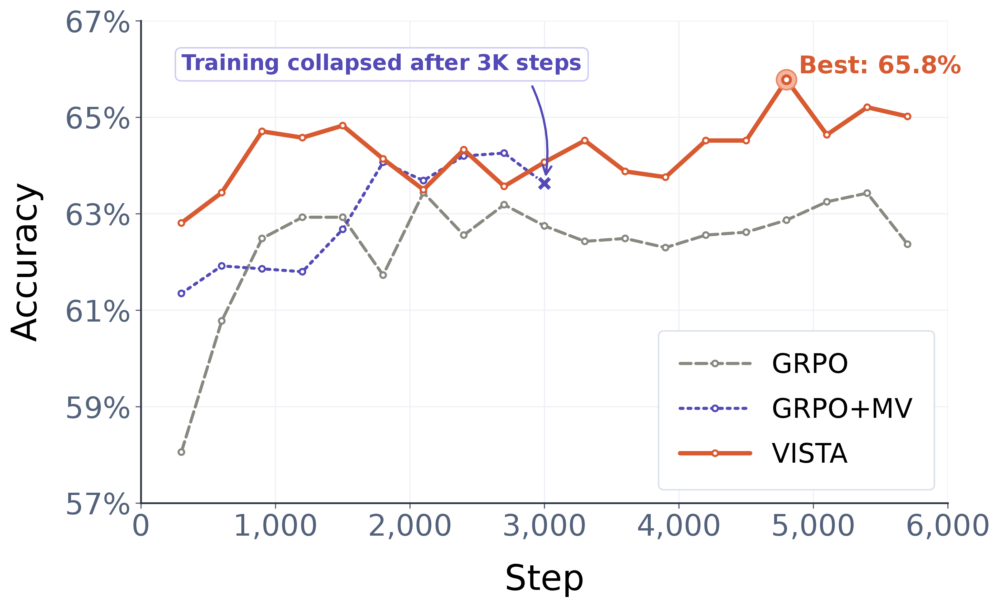
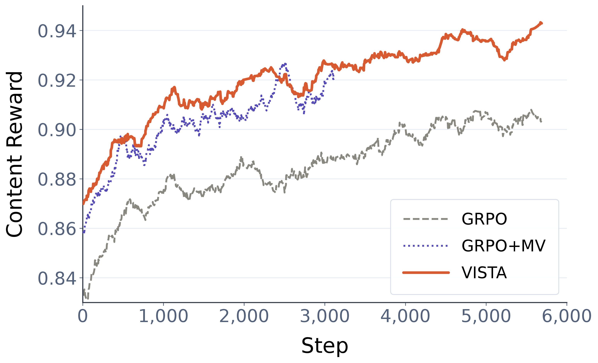
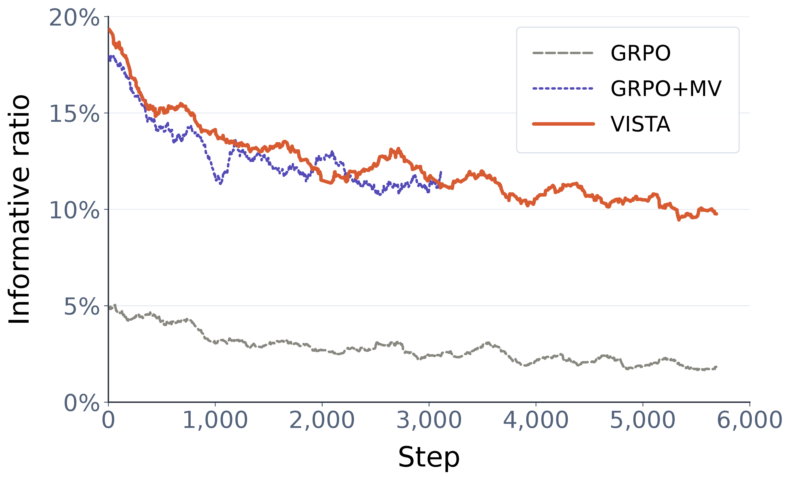
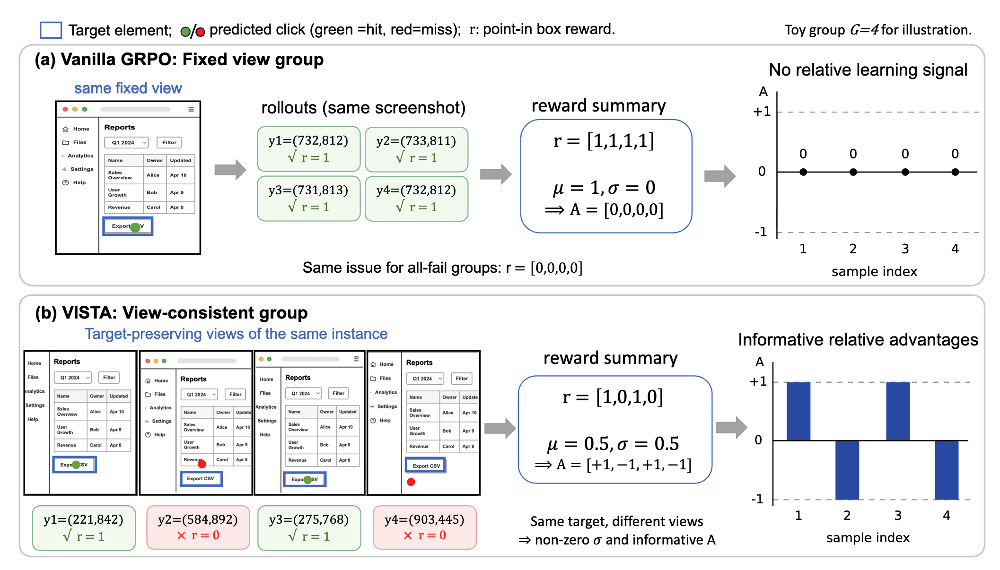
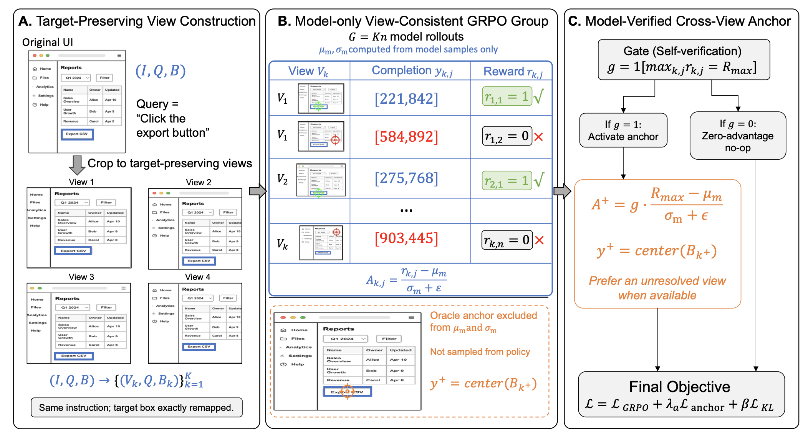

<div align="center">

## VISTA: View-Consistent Self-Verified Training for GUI Grounding

<!-- [](https://arxiv.org/abs/2601.01483) -->
[](https://zjuscl.github.io/VISTA)[](https://github.com/ZJUSCL/VISTA)

<p><strong>VISTA improves GUI grounding by building GRPO comparison groups from target-preserving views and stabilizing coordinate generation with a self-verified cross-view anchor.</strong></p>

</div>

## 📈 Training Dynamics

<div align="center">
  <table>
    <tr>
      <td align="center" width="33%">
        
        <br />
        <em>ScreenSpot-Pro accuracy &uarr;</em>
      </td>
      <td align="center" width="33%">
        
        <br />
        <em>Content reward &uarr;</em>
      </td>
      <td align="center" width="33%">
        
        <br />
        <em>Informative group ratio &uarr;</em>
      </td>
    </tr>
  </table>
  <p><em>Training dynamics and reward diagnostics.</em></p>
</div>

The training dynamics are measured with the Qwen3-VL-8B backbone.
VISTA achieves higher content reward and produces more informative comparison groups during training.
These stronger training signals translate into higher ScreenSpot-Pro accuracy.

## 🎉 News

- [2026-05-27] **We release the code for VISTA.**

## ✨ Highlights

- **View-consistent GRPO groups.** VISTA constructs each GRPO comparison group from multiple target-preserving views of the same GUI instance, with exact coordinate remapping across cropped views.
- **Self-verified cross-view anchor.** VISTA adds an oracle coordinate only when the current policy has already produced a maximum-reward rollout, keeping group statistics model-only and avoiding unconditional imitation on all-fail groups.
- **Consistent gains across scales.** On ScreenSpot-Pro, VISTA improves Qwen3-VL 4B/8B/30B-A3B from 55.5/52.7/53.7 to 63.4/65.8/67.0. On Qwen3.5-initialized 4B/9B/35B-A3B backbones, VISTA further improves over standard GRPO by +2.0/+0.9/+1.2 points.


## 📖 Motivation

<div align="center">
  
  <p><em>Motivation of VISTA.</em></p>
</div>

In vanilla GRPO, multiple rollouts from the same screenshot can produce homogeneous rewards, yielding zero relative advantage. VISTA constructs the group from target-preserving views of the same GUI instance. These views preserve the instruction and target semantics while changing the screenshot geometry. As a result, VISTA turns homogeneous fixed-view rewards into informative cross-view variation.

## 🧩 Method

<div align="center">
  
  <p><em>VISTA: View-Consistent Self-Verified Training for GUI Grounding.</em></p>
</div>

VISTA has two core components. **View-Consistent Group Rollout** builds each GRPO comparison group from target-preserving views of the same GUI instance, so rewards compare semantically equivalent but geometrically different inputs. **Self-Verified Cross-View Anchoring** adds an oracle-format coordinate only when the current policy has already produced a maximum-reward rollout, stabilizing coordinate generation while keeping the GRPO baseline defined by model outputs.


## 🛠️ Installation

```bash
conda create -y -n vista python=3.11
conda activate vista
bash setup.sh
```

## 📦 Data Preparation

Training data is configured through YAML files under `src/open-r1-multimodal/data_config/`. Update the `json_path` entries to point to your GUI-grounding annotation files, and set `--image_root` in `src/open-r1-multimodal/run_scripts/run_vista.sh` to the directory containing the corresponding screenshots.

Each grounding annotation JSON file should be a list of samples. Each sample contains the image path, grounding instruction, and normalized ground-truth box in `[x1, y1, x2, y2]` format:

```json
[
  {
    "image_path": "/path/to/image.jpg",
    "instruction": "your instruction",
    "gt": [
      0.828304,
      0.527885,
      0.838953,
      0.538301
    ]
  }
]
```

## 🚀 Training

> We recommend at least **8 × 80 GB GPUs** (e.g. A100 / H100) for training.

```bash
bash src/open-r1-multimodal/run_scripts/run_vista.sh
```

## 🔎 Evaluation

For grounding evaluation, please refer to [inclusionAI/UI-Venus](https://github.com/inclusionAI/UI-Venus). Configure the model checkpoint, dataset paths, image root, test split, and output path in the evaluation script before running it.

Note that VISTA uses a different grounding prompt from the default UI-Venus prompt. Before running evaluation, update the prompt template in the UI-Venus evaluation script (for example, `QUESTION_TEMPLATE`, `question_template`, or the equivalent prompt field) to match the current training prompt defined in `src/open-r1-multimodal/src/open_r1/vista.py`:

```text
Output the center point of the position corresponding to the instruction: {Question}. The output should just be the coordinates of a point, in the format [x,y].
```

Results are written to the `OUTPUT_PATH` configured in the evaluation script.


<!-- ## 📝 Citation

If you find VISTA useful, please cite:

```bibtex
@article{qiu2026vista,
  title={VISTA: View-Consistent Self-Verified Training for GUI Grounding},
  author={Qiu, Xinyu and Zhang, Yunzhu and Jia, Heng and Shen, Shuheng and Meng, Changhua and Zhu, Linchao},
  journal={arXiv preprint arXiv:2601.01483},
  year={2026}
}
``` -->


## 🙏 Acknowledgements

This repository builds on and benefits from several excellent open-source projects and resources, including [VLM-R1](https://github.com/om-ai-lab/VLM-R1).
